# Hi, I'm Francesco Belacca 👋

### Certified Azure Dev, Admin & DevOps Expert

  
  
  
  

## 🧑‍💻 About Me

Senior DevOps & Site Reliability Engineer | Azure & .NET Specialist

With 9+ years in the tech industry, I help organizations build, secure, and scale their cloud infrastructure. My background spans the full stack—from writing C# backend code to leading development teams and architecting cloud solutions for enterprise clients.

Currently, I serve as an SRE at Würth-IT, where I focus on Azure-centric DevOps, governance, and automation across Dynamics 365, Power Platform, and Entra ID services. I thrive in complex environments where operational excellence is critical.

**Key Competencies:**

- **Governance at Scale:** Navigating compliance and security in a massive single-tenant environment (85,000+ users, 500+ companies). I orchestrate stakeholders to ensure smooth approvals and operations in a complex corporate ecosystem.
- **Infrastructure as Code:** Expert in Bicep and YAML pipelines (GitHub Actions/Azure DevOps) to implement modern, rapid approaches for creating and destroying cloud infrastructure.
- **Backend Engineering:** Strong foundation in .NET and Blazor for building robust internal tools and customer-facing apps.
- **Security Automation:** Managing large-scale secret rotation (Key Vault) and identity security standards.
- **Cloud Solutions Architecting:** Utilizing rapid prototyping to demonstrate value, align stakeholders, and drive management strategies toward modern technical directions.
- **Power Platform Administration:** Managing and governing low-code environments at an enterprise level.

**🎯 My Mission: To build groundbreaking products that influence billions. I am passionate about simplifying complex distributed systems and applying Domain-Driven Design principles to solve real-world problems.**

*Based in Parma, Italy. Let's connect to talk about the future of Cloud Engineering and .NET.*

## 📊 GitHub Stats

  
  

## 🛠 Tech Stack

**Cloud & Infrastructure:** Microsoft Fabric · Business Central · Software Infrastructure · Azure · Microsoft Entra ID · Microsoft Dynamics 365 · Microsoft Power Platform · Cost Optimization · Cloud Security · Windows Azure · Containerization · Distributed Systems · Cloud Infrastructure

**Backend & Languages:** C# · SQL · OOP · ETL · .NET · JavaScript · LINQ · Database · Server Microsoft SQL · T-SQL · .NET Framework · Microservices

**DevOps & CI/CD:** Github Enterprise · Powershell Core · Bash · DSC · Automation · DevOps · Version Control · Troubleshooting · Continuous improvement · Git · Windows PowerShell · AZURE DEVOPS

**Frontend:** HTML · Kibana

**Methods & Tools:** Stakeholder Management · Public speaking · JIRA · wsl · Communication · Attention to Detail · Analytical Skills · Project management · Agile Methodologies · Agile Project Management · Visual Studio · Microsoft Office · Project Leadership · Generative AI · Search Engine Technology · Artificial Intelligence (AI) · Artificial Intelligence for Business · Chatbots · Microsoft Search

## 📜 Certifications

  
  
  

Other certifications & courses

- [**Career Essentials in Generative AI by Microsoft and LinkedIn** - Microsoft (Oct 2023 - Present)](https://www.linkedin.com/learning/certificates/16067e03e960ef0144dc31920fcaf387d7873ef227c5738cb99ff362ede92a8a)
- [**Kubernetes for developers** - Udemy (Apr 2023 - Present)](https://www.udemy.com/certificate/UC-67714a89-6f40-4717-93a7-cded4b75d711/)
- [**AZ-204 Developing for Microsoft Azure Exam Prep** - Udemy (Mar 2021 - Present)](https://www.udemy.com/certificate/UC-5957c389-228f-4488-aa31-c8cdd755f9af/)
- [**Speexx English CEFR Level C1.1** - Speexx (Sep 2020 - Present)](https://portal.speexx.com/certificate/MWVhOTEwZTctYzAxMy00NjY0LTk3MjItZmJiNDc5ZGFiMjJl)
- [**The Web Developer Bootcamp (40+ hours)** - Udemy (Jan 2018 - Present)](https://www.udemy.com/certificate/UC-SQ4MQOK7/)
- [**Getting Started with Angular 2+** - Udemy (Sep 2017 - Present)](https://www.udemy.com/certificate/UC-KKN29TB2/)
- [**MENSA ITALIA** - http://www.mensa.it/ (Feb 2014 - Present)](https://www.cloud32.it/GES/stampa?Ybrx%253hhjZog2Ynyqt1H58OUdkEJG6Re1y%3Fnbeu%2B26hcatWk%2B%3Fu%3F%2FFn6B%3DQQgJLJ9HBcNVWTqAVmobqbDy%2Bn%2F%25p30Jz6%3D%2FGIWckfomplKYPdUjy330)

## 💼 Experience

### **Site Reliability Engineer** @ Würth IT Italy (Sep 2024 - Present)
📍 Parma, Emilia-Romagna, Italy

- I’ve been the force-multiplier behind Würth-Phoenix’s Microsoft stack.
- Built and maintain complex, dynamic CI/CD in Azure DevOps and GitHub Enterprise for CRM/ERP and Business Central workloads.
- Wrote production PowerShell automation and .NET backend APIs to remove manual toil and harden processes.
- Rolling out Bicep for repeatable, reviewable IaC across environments.
- Lead admin/governance for tenants and repos (Azure, Entra ID, Business Central, Fabric, GitHub Enterprise), enforcing DevSecOps guardrails, RBAC, and compliance by default.
- Partner with developers to shift-left security, codify best practices, and unblock delivery at scale.

### **Presales Solutions Architect** @ Agic Cloud (Jul 2023 - Jul 2024)
📍 Parma, Emilia Romagna, Italia

- Designed Azure landing zones, application architectures, and migration plans for enterprise clients, focusing on scalability, security, and cost control.
- Led technical presales: shaped solutions, produced estimations, and supported bids for complex multi-service Azure projects.
- Drove DevOps adoption using Bicep, GitHub Actions/Azure DevOps YAML, and CI/CD patterns; standardized IaC and deployment practices across teams.
- Engaged with Dynamics teams as an enabler, defining integration patterns, securing workloads with Key Vault/Managed Identity, and improving delivery workflows.
- Collaborated with engineering teams to troubleshoot distributed systems, resolve reliability issues, and streamline cloud operations.

### **Backend Team Leader & Cloud Developer** @ Agic Cloud (Feb 2022 - Jul 2023)
📍 Parma, Emilia-Romagna, Italy

- Our cloud division (Vetrya Cloud) was bought by the AGIC Techonology group, becoming AGIC Cloud.
- Load tested multiple applications E2E using Azure Load Testing and Jmeter
- Built from the ground up and managed more than one Multi-Region project with Microsoft Consulting with a fully remote team
- Demonstrated AKS potential building and deploying a custom three layered containerized application using Github Actions, bicep, helm, Chaos Mesh, Azure Load Testing and made metric available using Prometheus and Grafana
- Led and helped the Agic Cloud Backend Team grow and succeed
- Contributed to Open Source projects for both Agic Cloud and myself on github

Earlier roles

- **Backend Team Leader & Cloud Developer** @ Vetrya · Parma, Emilia-Romagna, Italy (Full Remote) (Jun 2021 - Jan 2022)
  > As a Team Leader I helped my Team succeed and grow. We used Azure PaaS services to build multiple environments using the following technologies: Bot framework PBI Dashboard embedded in Azure Static...
- **Backend Developer/ Analyst** @ Credemtel SpA · Reggio nell'Emilia, Emilia Romagna, Italia (Apr 2020 - May 2021)
  > Worked as backend developer for multiple core application using various types of dbs(sql/ElasticSearch) developing microservices of a SAGA in the backend and APIs for the frontend. Used both .net Fram...
- **Backend Developer** @ Credemtel SpA · Reggio Emilia, Italia (Sep 2019 - Mar 2020)
  > Worked as backend developer for multiple core application using various types of dbs(sql/ElasticSearch) developing microservices of a SAGA in the backend and APIs for the frontend. Used both .net Fram...
- **Consultant - Backend Developer** @ Amaris · Reggio Emilia, Italia (Sep 2018 - Aug 2019)
  > Worked as consultant for Credemtel
- **Junior Backend Developer** @ ericsoft srl · Misano Adriatico (May 2016 - Aug 2018)
  > Developed various APIs integrations from Booking to expedia and Agoda for Ericsoft's Channel Manager. Started working with C#, EF, and basic SQL. Tested everything i developed with MSTests & learned...

> 📄 [Full career history on LinkedIn](https://www.linkedin.com/in/fbelacca/)

## 🚀 Featured Projects

- [**macel94**](https://github.com/macel94/macel94) — This profile auto-updates from LinkedIn using the [EU DMA Data Portability API](https://learn.microsoft.com/en-us/linkedin/dma/member-data-portability/member-data-portability-member/), a C# script, and GitHub Actions.

## 🎓 Education

- **Università degli Studi di Urbino 'Carlo Bo'** - Informatica Applicata(CS) (Sep 2014 - Jun 2020)
- **Liceo Scientifico A.Volta Riccione - Corso Sperimentale Brocca** - High School
  > Focus on advanced mathematics and natural sciences within an extended‑hours experimental curriculum.

## 🌐 Languages

- **English** — Full professional proficiency
- **Italian** — Native or bilingual proficiency

## 🤝 Volunteering

- **Azure Consultant** · education (Dec 2021 - Present)
  > I helped the company with their onboarding on azure for nonprofit helping them obtain 3000$ per year. I helped them choosing the right technology for their use case and building their website, setting up the db, custom domains, etc.  https://www.progettosole.org/

---

### 📥 Download CV

- [PDF Version](./artifacts/Francesco_Belacca_CV.pdf)
- [Europass XML](./artifacts/europass_cv.xml)

🔄 Auto-generated from LinkedIn via [DMA Data Portability API](https://learn.microsoft.com/en-us/linkedin/dma/member-data-portability/member-data-portability-member/) · Last updated: 2026-02-23 06:32 UTC

