# Hi, I'm Francesco Belacca 👋

### Cloud DevOps Engineer | CI/CD & IaC Specialist | Azure Certified

  
  
  
  

## 🧑‍💻 About Me

Senior Cloud DevOps & Site Reliability Engineer | Azure Platform & Automation Expert

With over 9 years of experience, I specialize in architecting, automating, and optimizing cloud infrastructure and deployment pipelines. My expertise spans end-to-end CI/CD, infrastructure as code, container orchestration, and release engineering for enterprise-scale environments on Azure.

Currently, as an SRE at Würth-IT, I drive Azure-centric DevOps initiatives, focusing on automated deployments, platform governance, and developer experience across Dynamics 365, Power Platform, and Entra ID. My passion lies in enabling rapid, secure, and reliable delivery through modern DevOps practices.

**Core Strengths:**

- **CI/CD & Release Engineering:** Designing and maintaining robust, scalable pipelines (Azure DevOps, GitHub Actions) for automated build, test, and deployment of cloud workloads.
- **Infrastructure as Code (IaC):** Expert in Bicep and YAML, delivering reproducible and auditable infrastructure using GitOps and automated provisioning.
- **Container Orchestration:** Deploying and managing containerized applications with AKS, Helm, and integrated monitoring solutions.
- **Configuration Management & DevSecOps:** Enforcing security, RBAC, and compliance by default; automating secret rotation and identity management at scale.
- **Platform Engineering:** Leading governance and administration for Azure, Entra ID, Business Central, and GitHub Enterprise, enhancing developer productivity and operational reliability.
- **Developer Experience:** Partnering with teams to codify best practices, shift-left security, and streamline delivery workflows.

**🎯 My Mission: To empower teams to deliver resilient, scalable cloud solutions through automation, infrastructure as code, and DevOps excellence.**

*Based in Parma, Italy. Connect with me to discuss cloud automation, DevOps, and platform engineering.*

## 📊 GitHub Stats

  
  

## 🛠 Tech Stack

**Cloud & Infrastructure:** Microsoft Fabric · Business Central · Software Infrastructure · Azure · Microsoft Entra ID · Microsoft Dynamics 365 · Microsoft Power Platform · Cost Optimization · Cloud Security · Windows Azure · Containerization · Distributed Systems · Cloud Infrastructure

**Backend & Languages:** C# · SQL · OOP · ETL · .NET · JavaScript · LINQ · Database · Server Microsoft SQL · T-SQL · .NET Framework · Microservices

**DevOps & CI/CD:** Github Enterprise · Powershell Core · Bash · DSC · Automation · DevOps · Version Control · Troubleshooting · Continuous improvement · Git · Windows PowerShell · AZURE DEVOPS

**Frontend:** HTML · Kibana

**Methods & Tools:** Stakeholder Management · Public speaking · JIRA · wsl · Communication · Attention to Detail · Analytical Skills · Project management · Agile Methodologies · Agile Project Management · Visual Studio · Microsoft Office · Project Leadership · Generative AI · Search Engine Technology · Artificial Intelligence (AI) · Artificial Intelligence for Business · Chatbots · Microsoft Search

## 📜 Certifications

  
  
  

Other certifications & courses

- [**Career Essentials in Generative AI by Microsoft and LinkedIn** - Microsoft (Oct 2023 - Present)](https://www.linkedin.com/learning/certificates/16067e03e960ef0144dc31920fcaf387d7873ef227c5738cb99ff362ede92a8a)
- [**Kubernetes for developers** - Udemy (Apr 2023 - Present)](https://www.udemy.com/certificate/UC-67714a89-6f40-4717-93a7-cded4b75d711/)
- [**AZ-204 Developing for Microsoft Azure Exam Prep** - Udemy (Mar 2021 - Present)](https://www.udemy.com/certificate/UC-5957c389-228f-4488-aa31-c8cdd755f9af/)
- [**Speexx English CEFR Level C1.1** - Speexx (Sep 2020 - Present)](https://portal.speexx.com/certificate/MWVhOTEwZTctYzAxMy00NjY0LTk3MjItZmJiNDc5ZGFiMjJl)
- [**The Web Developer Bootcamp (40+ hours)** - Udemy (Jan 2018 - Present)](https://www.udemy.com/certificate/UC-SQ4MQOK7/)
- [**Getting Started with Angular 2+** - Udemy (Sep 2017 - Present)](https://www.udemy.com/certificate/UC-KKN29TB2/)
- [**MENSA ITALIA** - http://www.mensa.it/ (Feb 2014 - Present)](https://www.cloud32.it/GES/stampa?Ybrx%253hhjZog2Ynyqt1H58OUdkEJG6Re1y%3Fnbeu%2B26hcatWk%2B%3Fu%3F%2FFn6B%3DQQgJLJ9HBcNVWTqAVmobqbDy%2Bn%2F%25p30Jz6%3D%2FGIWckfomplKYPdUjy330)

## 💼 Experience

### **Site Reliability Engineer** @ Würth IT Italy (Sep 2024 - Present)
📍 Parma, Emilia-Romagna, Italy

- Architect and maintain complex, automated CI/CD pipelines in Azure DevOps and GitHub Enterprise for CRM/ERP and Business Central workloads, enabling rapid and reliable releases.
- Develop production-grade PowerShell automation and .NET backend APIs to eliminate manual tasks and strengthen deployment processes.
- Implement Bicep-based infrastructure as code for consistent, version-controlled provisioning across environments.
- Lead governance and administration for Azure, Entra ID, Business Central, Fabric, and GitHub Enterprise tenants and repositories, enforcing DevSecOps guardrails, RBAC, and compliance automation.
- Collaborate with developers to shift-left security, codify best practices, and accelerate delivery through platform engineering and automation.

### **Presales Solutions Architect** @ Agic Cloud (Jul 2023 - Jul 2024)
📍 Parma, Emilia Romagna, Italia

- Designed Azure landing zones and cloud architectures with a focus on automated deployment, scalability, and secure configuration management.
- Led technical presales, producing solution estimates and supporting bids for enterprise Azure projects involving multi-service integration and migration.
- Championed DevOps adoption by standardizing CI/CD pipelines, IaC (Bicep), and deployment automation with GitHub Actions and Azure DevOps YAML.
- Defined integration and security patterns for Dynamics workloads, leveraging Key Vault and Managed Identity to enhance delivery pipelines.
- Worked with engineering teams to troubleshoot distributed systems, resolve reliability challenges, and optimize cloud operations through automation.

### **Backend Team Leader & Cloud Developer** @ Agic Cloud (Feb 2022 - Jul 2023)
📍 Parma, Emilia-Romagna, Italy

- Led remote teams to build and manage multi-region Azure projects, leveraging PaaS and IaC for scalable, resilient cloud environments.
- Load tested applications end-to-end using Azure Load Testing and JMeter, integrating performance validation into release pipelines.
- Demonstrated AKS and container orchestration by architecting and deploying a custom three-layered application using GitHub Actions, Bicep, Helm, Chaos Mesh, and Azure Load Testing, with monitoring via Prometheus and Grafana.
- Guided backend team growth and success through DevOps best practices and automation.
- Contributed to open source projects, focusing on deployment automation and developer experience.

Earlier roles

- **Backend Team Leader & Cloud Developer** @ Vetrya · Parma, Emilia-Romagna, Italy (Full Remote) (Jun 2021 - Jan 2022)
  > Led team success and growth by implementing Azure PaaS services and automating environment provisioning. Built multiple environments using Bot Framework, Power BI Dashboard embedded in Azure Static Web Apps, and streamlined CI/CD workflows.
- **Backend Developer/ Analyst** @ Credemtel SpA · Reggio nell'Emilia, Emilia Romagna, Italia (Apr 2020 - May 2021)
  > Developed backend microservices and APIs using .NET and SQL/ElasticSearch, supporting SAGA patterns and automated build/deployment pipelines. Enhanced reliability and delivery through version control and continuous integration.
- **Backend Developer** @ Credemtel SpA · Reggio Emilia, Italia (Sep 2019 - Mar 2020)
  > Built backend microservices and APIs for core applications, utilizing .NET and multiple databases. Integrated CI/CD and automated testing to improve release quality.
- **Consultant - Backend Developer** @ Amaris · Reggio Emilia, Italia (Sep 2018 - Aug 2019)
  > Provided backend development and DevOps support for Credemtel, focusing on build automation and deployment reliability.
- **Junior Backend Developer** @ ericsoft srl · Misano Adriatico (May 2016 - Aug 2018)
  > Developed API integrations for channel management, working with C#, EF, and SQL. Automated testing with MSTests and contributed to build system improvements.

> 📄 [Full career history on LinkedIn](https://www.linkedin.com/in/francesco-belacca-dev/)

## 🚀 Featured Projects

- [**macel94**](https://github.com/macel94/macel94) — This profile auto-updates from LinkedIn using the [EU DMA Data Portability API](https://learn.microsoft.com/en-us/linkedin/dma/member-data-portability/member-data-portability-member/), a C# script, and GitHub Actions.

## 🎓 Education

- **Università degli Studi di Urbino 'Carlo Bo'** - Informatica Applicata(CS) (Sep 2013 - Jun 2020)
- **Liceo Scientifico A.Volta Riccione - Corso Sperimentale Brocca** - High School
  > Focus on advanced mathematics and natural sciences within an extended‑hours experimental curriculum.

## 🌐 Languages

- **English** — Full professional proficiency
- **Italian** — Native or bilingual proficiency

## 🤝 Volunteering

- **Azure Consultant** · education (Dec 2021 - Present)
  > I helped the company with their onboarding on azure for nonprofit helping them obtain 3000$ per year. I helped them choosing the right technology for their use case and building their website, setting up the db, custom domains, etc.  https://www.progettosole.org/

---

### 📥 Download CV

- [PDF Version](./Francesco_Belacca_CV.pdf)
- [Europass XML](./artifacts/europass_cv.xml)

🔄 Auto-generated from LinkedIn via [DMA Data Portability API](https://learn.microsoft.com/en-us/linkedin/dma/member-data-portability/member-data-portability-member/) · Last updated: 2026-03-11 14:08 UTC
